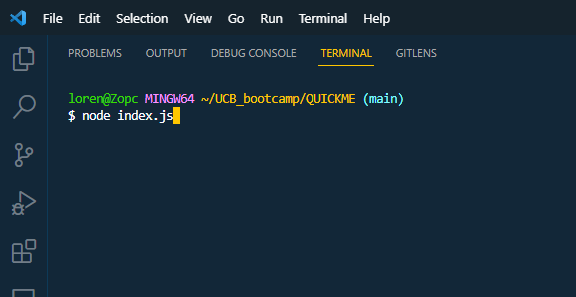

# QUICKME

## Description

QUICKME is a project that takes in user input to generate a structured and organized README with your input answers. It allows for a faster way to make professional README files by generatiing a template instead of having to type everthing out yourself.

## Table of Contents (Optional)

- [Installation](#installation)
- [Usage](#usage)
- [Credits](#credits)
- [License](#license)

## Installation

In order to install QUICKME, transfer the index.js & package.json files into your VS CODE, then proceed to run "npm i" in the terminal to install the dependencies.

## Usage

To use QUICKME, first go to your terminal and enter "node index.js". You will be prompted with a series of questions pertaining to the README template. Read the questions carefully and follow up by inputting your response! Pressing "ENTER" will submit the response SO BECAREFUL TO NOT USE "ENTER" UNLESS YOU ARE READY TO SUBMIT!

## Credits

[Professional README Guide](https://coding-boot-camp.github.io/full-stack/github/professional-readme-guide)

## License

MIT License

## Questions

Contact me here.

GitHub: [GitHub Profile Link](https://github.com/Lorenzo-Olivar)

Email: lorenzoolivar9@gmail.com

---
